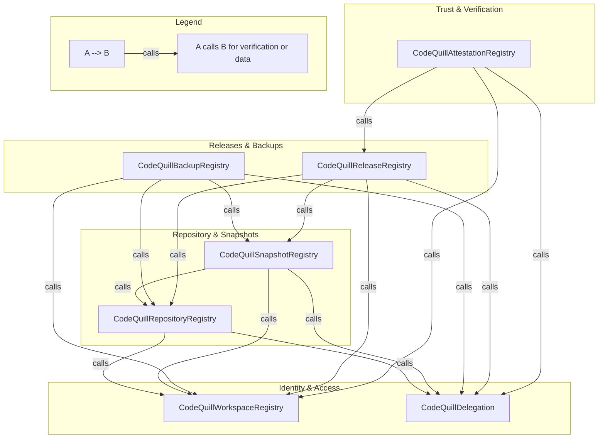
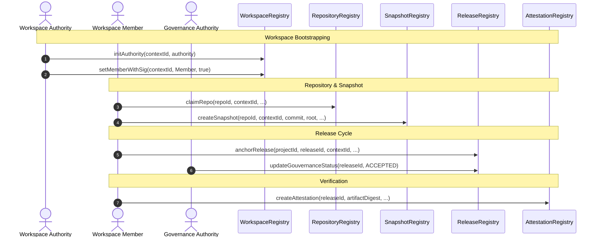

# CodeQuill Architecture

This document describes the high-level architecture of the CodeQuill smart contracts and their relationships.

## Contract Relationship Graph

The following diagram illustrates how the different registries in the CodeQuill ecosystem interact with each other and share context.

### Arrow Semantics
- **calls**: The source contract invokes a view function on the target contract to verify permissions (e.g., `isMember`, `isAuthorized`) or to validate the existence of a referenced entity (e.g., `repoOwner`, `snapshotIndexByRoot`).
- **stores address/reference**: Implicit in the "calls" relationship, as dependent contracts store the immutable addresses of the registries they interact with.

---

## Key User Journey: Software Release Flow

The most central journey in CodeQuill is the path from claiming a repository to anchoring an attested release.

---

## How to keep this updated

1. **New Registries**: If a new registry is added, add it to the appropriate subgraph in the Relationship Graph and define its dependencies.
2. **Interface Changes**: If the interaction pattern between contracts changes (e.g., a contract starts depending on another one it didn't use before), update the Mermaid arrows.
3. **New User Journeys**: If significant new functionality is added (e.g., a new DAO integration or complex delegation logic), consider adding a new sequence diagram.
